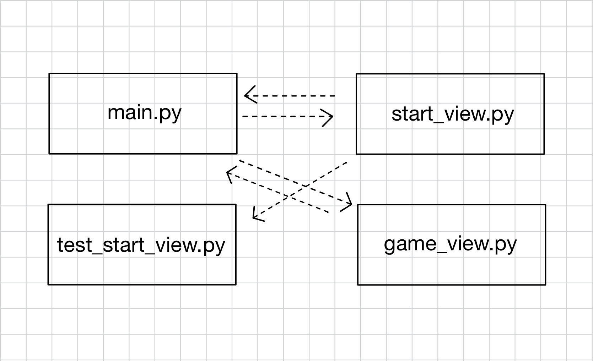
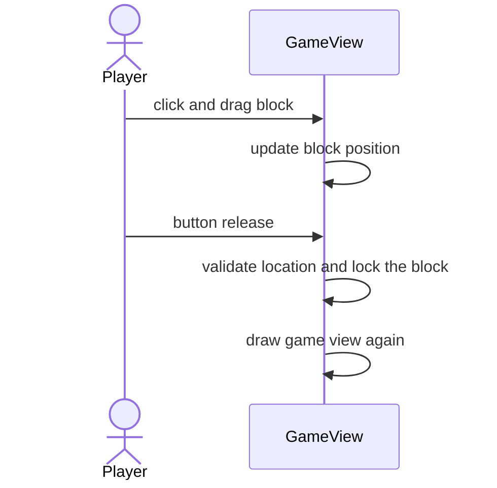

## Toiminnallisuuksia

### Blokin sijoittaminen ruudukkoon

Ohessa sekvenssikaaviolla kuvattuna blokin asettaminen peliruudukkoon.

Kun pelaaja painaa ja raahaa palikkaa, päivittyy palikan sijainti hiiren sijainnin perusteella. Hiiren napin vapauttamisen jälkeen varmistetaan palikan sallittava sijainti ja lukitaan se ruudukkoon.