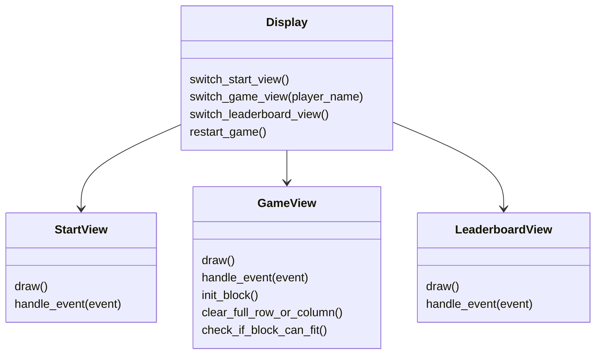
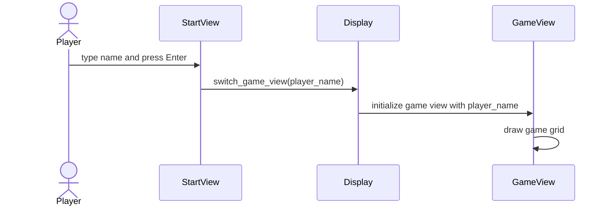
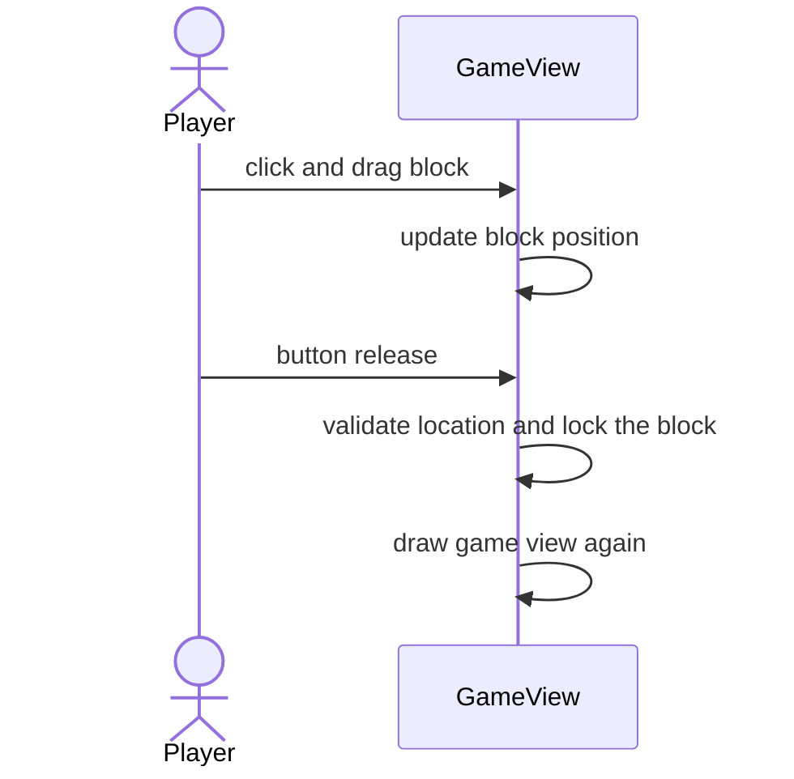
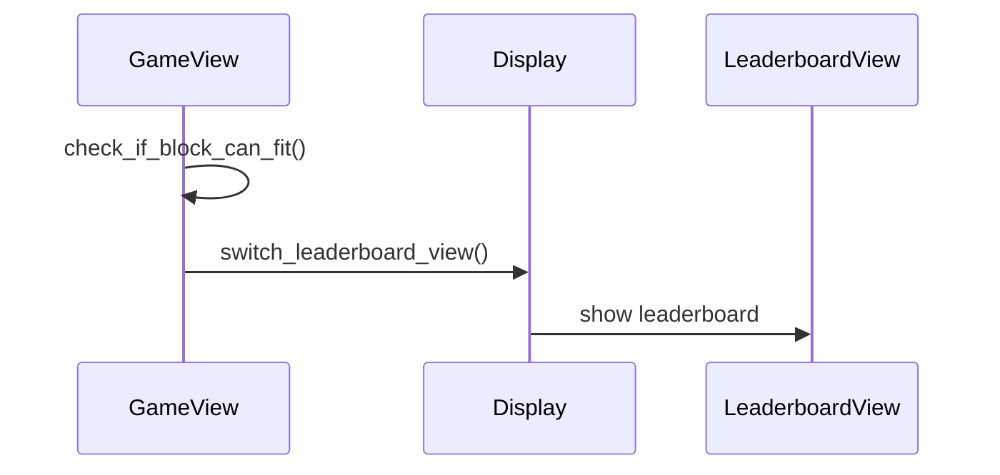

# Arkkitehtuurikuvaus

## Rakenne

## Käyttöliittymä

Käyttöliittymä koostuu toistaiseksi kahdesta näkymästä:

- Aloitusnäkymä, jossa käyttäjä syöttää nimensä.

- Pelinäkymä, jossa peliä pelataan.

- Tulostaulukkonäkymä, jossa näkee tulokset ja voi aloittaa uuden pelin tai vaihtaa pelaajaa.

Kaikki näkymät ovat omissa luokissa ja omissa tiedostoissa "views" kansion sisällä. Käyttöliittymä on selkeästi eriytetty sovelluslogiikasta omilla metodeillaan.

## Sovelluslogiikka

Sovelluksen loogisen titomallin muodostaa GameView, StartView ja LeaderboardView -luokat, nämä vastaavat pelin näkymistä ja toiminnallisuuksista. Siirtyminen näkymien välillä tapahtuu Display luokan kautta main.py:ssä.

## Toiminnallisuuksia

### Nimen syöttö

Kun alussa pelaaja syöttää nimensä ja painaa Enter, niin sovellus etenee pelinäkymään seuraavasti:

### Blokin sijoittaminen ruudukkoon

Ohessa sekvenssikaaviolla kuvattuna blokin asettaminen peliruudukkoon.

Kun pelaaja painaa ja raahaa palikkaa, päivittyy palikan sijainti hiiren sijainnin perusteella. Hiiren napin vapauttamisen jälkeen varmistetaan palikan sallittava sijainti ja lukitaan se ruudukkoon.

### Häviäminen

Kun seuraava palikka ei enään mahdu ruudukkoon, niin tapahtuu seuraavasti:

Tarkistetaan siis mahtuuko palikka, jos ei niin edetään pistetaulukkoon.

## Heikkoudet

- Käyttöliittymän koodissa toistuvuutta luokissa, kun mm. piirtäminen on samanlaisia.

