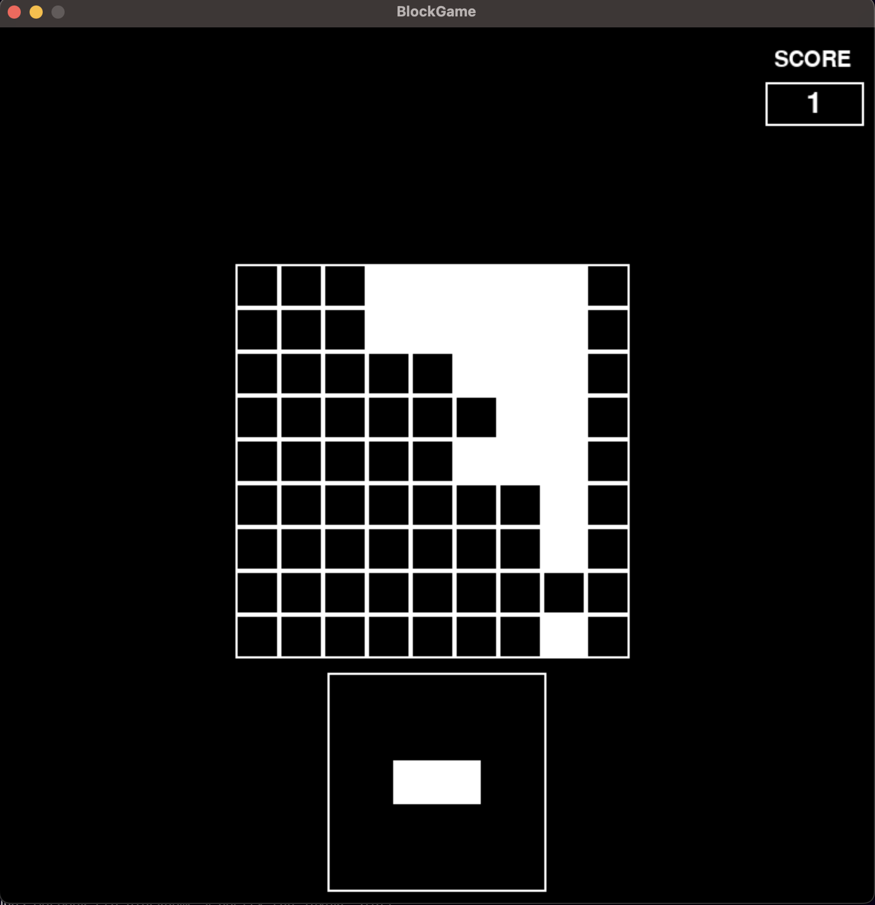
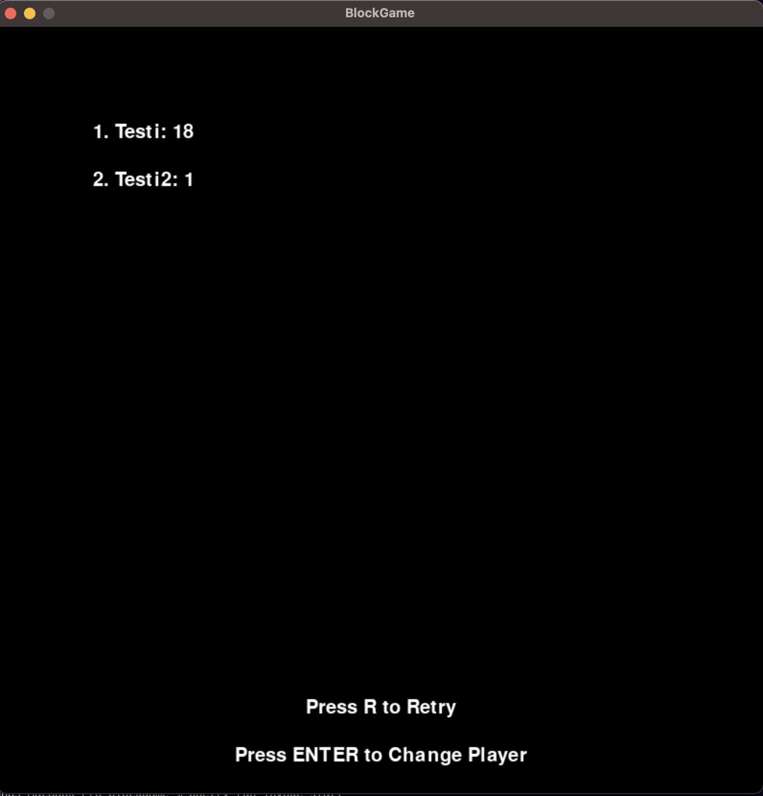

# KÄYTTÖOHJE

## Käynnistäminen

Asenna riippuvuudet komennolla:

```bash
poetry install
```

Käynnistä komennolla:

```bash
poetry run invoke start
```

## Nimen syöttäminen

Syötä nimesi aloitusnäkymässä ja paina ENTER-painiketta.


## Pelin pelaaminen

Päästyäsi pelinäkymään näytön alareunaan ilmestyy palikka, joka pelaajan on tarkoitus raahata vapaana olevaan kohtaan ruudukossa. Saadessasi rivin tai sarakkeen täyteen, se tyhjenee ja saat pisteen. Ideana on kerätä mahdollisimman monta pistettä. Pelin häviää, kun palikka ei mahdu enään ruudukkoon.



## Pelin hävittyä

Kun häviät pelin, pääset pistetaulukkonäkymään, josta voit aloittaa suoraan uuden pelin painamalla R-näppäintä. Voit myös vaihtaa pelaajaa painamalla ENTER-näppäintä.


