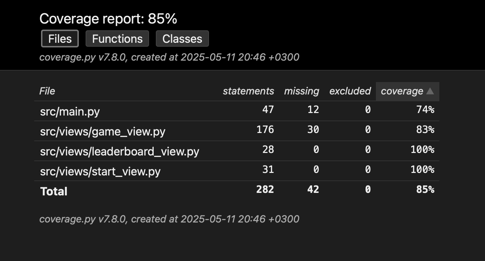

# Testausdokumentti

Ohjelman testaus on tehty "tests" kansion testaustiedostoilla yksikkötesteinä.

### Sovelluslogiikka

Sovelluslogiikasta vastaavia luokkia, kuten GameView, StartView, ja LeaderboardView, testataan yksikkötesteillä. Näiden luokkien toiminnallisuuksia esim. pelinäkymän piirto, tapahtumien käsittely ja pelin logiikkaa, kuten rivien tyhjentäminen ja pisteiden lisääminen, testataan kattavasti. Testit on toteutettu unittest-kirjastolla tests-kansiossa.

### Display-luokka

Main.py:n Display-luokan toiminnallisuuksia, kuten näkymien vaihtamista (switch_start_view, switch_game_view, switch_leaderboard_view) ja pelin uudelleenkäynnistämistä (restart_game), testataan testitapauksilla. 

### Testauskattavuus

Haaraumakattavuus ylti 85%.

## Ongelmat

### Testauksen ongelmat

Testaus on pyritty luomaan kattavaksi, mutta puutteita jäi. 
Pelipalikoiden satunnaisen luonnin takia testaus vaikeutui, jonka olisi voinut ajan kanssa toteuttaa huomattavasti paremmin. Testien kanssa oli tämä takia vaikeuksia saada ne toimimaan jokaisella yrityksellä. Nyt kuitenkin kaikki testit menivät läpi useammalla läpikäytöllä putkeen.

### Sovelluksen laatuongelmat

- Virheilmoitukset puuttuvat. Nämä olisi hyvä olla esim. tilanteessa, jossa nimeä ei syötetä oikein/on liian pitkä yms.

- Sovellus ei ylipäätään sisällä rajoitusta nimensyötölle tällä hetkellä.

- Lint jäi heikoksi, oli mm. vaikeuksia "no-member" ilmoituksen suhteen. 

